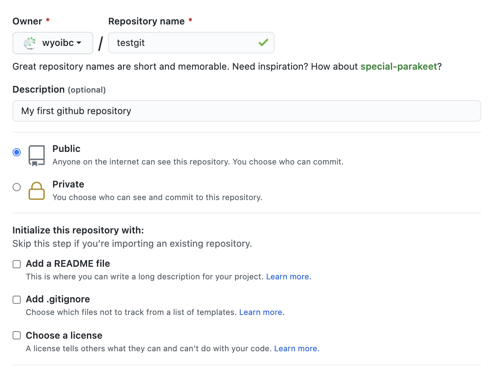

## Table of Contents

- [1. What is version control and do I need it?](#what-is-version-control-and-do-i-need-it)


- [2. Create a new GitHub repository](#create-a-new-github-repository)


- [3. Working locally with git](#working-locally-with-git)

	- [3.1 Initialize new git repository](#initialize-new-git-repository)

	- [3.2 Generate some content](#generate-some-content)

	- [3.3 Using R to create graphics](#use-r-to-create-graphics)

	- [3.4 Finish making changes to the repository](#finish-making-changes-to-the-repository)

	- [3.5 Configure git](#configure-git)

	- [3.6 Add and commit repository content](#add-and-commit-repository-content)

	- [3.7 Push the repository to GitHub](#push-the-repository-to-github)


- [4. Secure authentication with SSH](#secure-authentication-with-ssh)

	- [4.1 Generate SSH Key Pair](#generate-ssh-key-pair)

	- [4.2 Associate Public Key with GitHub](#associate-public-key-with-github)

	- [4.3 Configure Your System to Use SSH Keys](#configure-your-system-to-use-ssh-keys)

	- [4.4 Test Your SSH Key](#test-your-ssh-key)

	- [4.5 Practice pushing some more](#practice-pushing-some-more)


<br><br><br><br><br>
<br><br><br><br><br>
<br><br><br><br><br>
<br><br><br><br><br>
<br><br><br><br><br>
<br><br><br><br><br>


## 1. What is version control and do I need it?

- Ability to keep track of incremental changes made to a project is at the heart of version control. A simple example is a computer program that performs a specific function.  When a developer writes the first working version of this program, it is generally labeled as v1.0. As more features and functions are developed and added to the program, its version number continues evolving gradually from 1.0 to 1.0.1 to 1.1, 1.2, 2.0 and so on and so forth.  Additionally, the developer may have made many other numerous changes to the code which likely did not end up in the next released version.

- What if the developer discovered that one such change rendered the program dysfunctional and wanted to revert to the last functional version? That type of control on the development process is what underlies version control.

- Of course, a computer program is not the only project where version control is useful. It is equally useful when writing manuscripts for publication, book chapters, data analysis protocols, thesis, dissertation. Essentially any project that continues to evolve can benefit from version control. In other words, you don't have to be a computer scientist to employ version control in your work.


- ``Git`` is a program on your computer ([see Prep for installation instructions](../prep/index.html) which performs version control functions on a project of your choice.  In this session, we will work with ``git`` to create a new repository of code and then store it on your GitHub account.


## 2. Create a new GitHub repository

- Navigate your browser to https://github.com/YOUR_USER_NAME. In the top right hand corner, you will see a ``+`` button. Click on it and choose ``New Repository`` option.  This will generate a page like the following:

<br>
<center>

</center>
<br>


- Populate this page with some information as shown below. Then click ``Create repository``.

<br>
<center>

</center>
<br>

- You have just created an empty github repository. Now we will work on creating contents for this repository on our local machine.


## 3. Working locally with git

- Open a terminal session. Windows users will start ``gitbash`` by right clicking on desktop and choosing that option.

- Create a folder named ``Github`` somewhere on your computer


```bash

cd /Users/your_name

mkdir Github

cd Github

pwd

/Users/your_name/Github/

```


<br>

### 3.1 Initialize new git repository

- Create your repository folder using the same name as you did on github

```bash

mkdir testgit

cd testgit/

```

- Download and save [us.csv](us.csv) file into ``/Users/your_name/Github/testgit``. This file contains data from New York Times that details COVID-19 cases and deaths over the course of the pandemic. We will use this data set to generate some content for our repository.


<br>

- Initialize the new git repository

```bash
pwd

/Users/your_name/Github/testgit

git init

```


<br>

### 3.2 Generate some content

- Create a new file called ``README.md`` in the repository

```bash
touch README.md
```

- Open the new file in either ``vim`` (terminal version) or ``macvim`` (gui version). Windows users can open the gui version.

```bash

vim README.md

```

- Note that ``vim`` has two modes: edit and command. To edit file, press ``i`` to enter the insert mode. You can revert to command mode by using ``ESC`` key on your keyboard.


- Modify the file as follows:


```bash
---
title: COVID-19 Cases & Deaths
author: Your Name
date: June 22, 2022
---

```

- This part is called the document preamble. 


<br>

### 3.3 Use R to create graphics

- Now go back to the terminal and fire up a R session. You may also choose to use Rstudio for the following exercise.

- Import the ``us.csv`` file into R's memory

```r

df <- read.csv("us.csv", header=T)

head(df)

        date cases deaths
1 2020-01-21     1      0
2 2020-01-22     1      0
3 2020-01-23     1      0
4 2020-01-24     2      0
5 2020-01-25     3      0
6 2020-01-26     5      0


dim(df)

[1] 489   3

```

- This shows that the data is organized into 3 columns and 489 rows. We will now make a scatterplot of COVID-19 cases.


```r

plot(1:489, df$cases, pch=16, col='darkgreen', cex=0.5, xlab="Days (2020 & 2021)", ylab="Num. Cases", main="COVID-19 Cases in the United States")


```

- Notice how we created a simple vector of length 489 as an argument for ``x`` axis. We could have used dates, but that complicates the things a bit, so we will explore that later.

- This code should generate a plot like the one here:

<br>
<center>

</center>

- We will now save this plot as a png formatted image in the current folder

```r

png("covid_cases.png", width=10, height=10, units="inches", res=600)

plot(1:489, df$cases, pch=16, col='darkgreen', cex=0.5, xlab="Days (2020 & 2021)", ylab="Num. Cases", main="COVID-19 Cases in the United States")

dev.off()

```

- If the above code worked, you should now have an image called ``covid_cases.png`` in your ``testgit/`` folder.


<br>

### 3.4 Finish making changes to the repository

- Let's go back to the ``README.md`` file that we were working on before and add the following items:


```bash

---
title: COVID-19 Cases & Deaths
author: Your Name
date: June 22, 2022
---

1. The following plot shows number of COVID-19 cases in the United States from January 2020 through May 2021.


<center>

</center>

```

- To save and close the file, press ``ESC`` key, then type ``:wq`` and hit ``ENTER``.  That's it, you have now saved ``README.md`` 


<br>

### 3.5 Configure git


- Provide the git engine with the information on your git credentials and the new upstream repository:

```bash

git config user.name "YOUR_GITHUB_USERNAME"

git config user.email "YOUR_GITHUB_ASSOCIATED_EMAIL_ADDRESS"

```

- Verify these settings were properly set

```bash

git config --list

user.name=wyoibc
user.email=wyoinbre@gmail.com

```

- The above output should reflect your own information.  

- Set up upstream information about the repository

```bash

git remote add origin https://github.com/YOUR_GITHUB_USERNAME/testgit.git

```

- Again, verify

```bash

git remote -v

origin	https://github.com/wyoibc/testgit.git (fetch)
origin	https://github.com/wyoibc/testgit.git (push)

```


<br>

### 3.6 Add and commit repository content

- Before git starts keeping track of your file, you will need to add them to it's memory


```bash

git add .

```

- Notice the ``.`` (period) above. That means add everything in the current location (``..testgit/``

- Check git status

```bash

git status

On branch master

No commits yet

Changes to be committed:
  (use "git rm --cached <file>..." to unstage)
	new file:   README.md
	new file:   covid_cases.png
	new file:   us.csv

```

- Now commit the files for pushing upstream

```bash

git commit -m "Add a helpful message here, e.g. initial commit"

[master (root-commit) 962e188] initial commit
 3 files changed, 504 insertions(+)
 create mode 100644 README.md
 create mode 100644 covid_cases.png
 create mode 100644 us.csv

```


<br>

### 3.7 Push the repository to GitHub


- Finally, push all the files to your upstream repository


```bash

git push -u origin master


```

- **This will predictably fail**. Github no longer allows pushing with user/password credentials. It requires a more secure form of authentication. 


<br><br><br>

## 4. Secure Authentication with SSH


- When you used your login credentials to push contents of your local repository to a new and empty remote GitHub repository, you may have received an email-notice from GitHub that this method of authentication is *deprecated*. That's computer science lingo for "about to be phased out". What that means is that sometime soon, using username and password to push contents to github will no longer work (don't confuse this with logging onto Github.com, which will still use those credentials.

- Instead, you will be using a much more secure form of login called ``SSH``, short for **S**ecure **SH**ell. A SSH password is called a ``key``, which is much longer than a typical, secure password. But perhaps even more importantly, it is encrypted.

- A SSH key comes as a pair of a public password, and a private password.  You provide your public part to others who you wish to securely communicate with (i.e. Github in this instance). The private key should never be shared with anyone for any purpose. It will sit securely on your computer inside a hidden folder.

- In this section, we will generate a SSH key pair and then associate the public key with your Github.com account.  

<br>

### 4.1 Generate SSH Key Pair

- On Macintosh and other Unix-like systems, SSH key pair can be generated using a program called ``ssh-keygen``. It comes preinstalled with the OS. Windows users should be able to access this program inside ``git bash``.


```bash
ssh-keygen -t rsa -b 4096 -C "name@host.edu"
```

- Here, ``-t rsa`` flag tells the program to use ``RSA`` encryption algorithm when generating the private key.  RSA stands for first initials of the three authors who developed this algorithm (Rivest, Shamir & Adleman) in 1977.

- ``-b`` flag denotes amount of bits to use (size of the key)

- ``-C`` flag allows a comment, which in this case is your email address associated with github. It will become part of your key.

- Once you hit enter, your system will present the following dialogue:

```bash
Generating public/private rsa key pair.
Enter file in which to save the key (/Users/wyoibc/.ssh/id_rsa): 
```

- Notice that the keys will be stored inside your home directory in a hidden folder named ``.ssh``.  

- By default the keys are named: ``id_rsa`` (private) and ``id_rsa.pub`` (public). But you don't have to keep this name. If you wish to change is, type it out. An example could be: ``/Users/wyoibc/.ssh/t_rex``.  If you want to keep the default, just hit enter.

- Next, the system will ask if you want to protect these keys with a passphrase. If you choose to enter a passphrase, you will need to memorize it and the system will ask you to enter it everytime you wish to use the key. I personally always use a passphrase. 

```bash
Enter passphrase (empty for no passphrase): 

Your identification has been saved in /Users/wyoibc/.ssh/t_rex.
Your public key has been saved in /Users/wyoibc/.ssh/t_rex.pub.
The key fingerprint is:
SHA256:4ps5bMhN7293Grtr0v+dCsUI4Ji02WQL9v+Wut7uOu4 name@host.edu
The key's randomart image is:
+---[RSA 4096]----+
|     + +         |
|    o % o        |
|     = = .       |
|        . . o    |
|      . S. . o   |
|     ...  . o    |
|   . =..   *.    |
|    o =+..* =o. o|
|     .+o=EBB=Booo|
+----[SHA256]-----+
```

<br>

### 4.2 Associate Public Key with GitHub

- Next we need to copy our public key and associate it with our GitHub account.


```bash
cd /Users/wyoibc/.ssh/

pbcopy < t_rex.pub  
```

- The key has now been copied to your clipboard.

- Next, go to GitHub.com and login to your account. Choose settings, and then SSH keys as follows:


<br>
<center>
 
</center>
<br>


- Click on ``New SSH key`` and use ``ctrl+V`` to paste your public key into the available box and choose a title. Leave no spaces in the title. A title is just an identifier for your key. Finally, choose ``Add SSH key`` to complete the process.


<br>
<center>
 
</center>
<br>

- Once you have added the key, it will appear in your account as follows:

<br>
<center>
 
</center>
<br>


<br>

### 4.3 Configure Your System to Use SSH Keys

- First, make sure that ``ssh-agent`` is enabled on your system, and add your newly created ssh key to the agent. If you set up a passphrase earlier, you will need to enter it now.

```bash
ssh-agent -s

ssh-add /Users/wyoibc/.ssh/t_rex
```

- Make sure that the ssh-agent is using your key.

```bash
ssh-add -l

4096 SHA256:uMFoUIUC7osmgDQaNowsOnqEt3XmPPZe4RnR2+Q1KB0 name@host.edu (RSA)
```

- Second, open the configuration file for ssh

```bash
cd /Users/wyoibc/.ssh

vim config
```

- If this file doesn't exist, you will be creating a new one.  Add following lines to this file:


```bash
Host *
   AddKeysToAgent yes
   UseKeychain yes

Host wyoibc.github.com
        HostName github.com
        User git
        PreferredAuthentications publickey
        IdentityFile ~/.ssh/t_rex

```

- Save and close the file.


```bash
:wq
```


<br>

### 4.4 Test Your SSH Key

- First, make sure GitHub recognizes your SSH keys:


```bash

ssh -T git@github.com

```

- You may see a message like the following:

```bash
> The authenticity of host 'github.com (IP ADDRESS)' can't be established.
> RSA key fingerprint is SHA256:nThbg6kXUpJWGl7E1IGOCspRomTxdCARLviKw6E5SY8.
> Are you sure you want to continue connecting (yes/no)?

```

- Type ``yes`` and then you should be seeing the following message:

```bash
> Hi username! You've successfully authenticated, but GitHub does not
> provide shell access.

```

- Now we are ready to push the contents we previously generated.

```bash
git push -u origin master

```

- Did that work? If the push was successful, check those contents online.


<br><br>

### 4.5 Practice pushing some more

- Now go back and make some changes to the git repository we created last time: ``testgit``.

- Create a new plot to include number of deaths from COVID-19 over the same time period as before.

```bash
cd /Users/wyoibc/Dropbox/Github/testgit
```

- Use R to load the data and redraw the scatterplot as before.

```r
df <- read.csv("us.csv", header=T)

plot(1:489, df$deaths, pch=16, col="salmon", cex=0.5, xlab="Days", ylab="Num. Deaths")
```

- Save this plot as before, but combine it with the previous plot to make a one-row, two-column multi-plot.  


```r
png("covid_combined.png", width=10, height=7, unit="in", res=600)

par(mfrow=c(1,2), mar=c(5,4,4,2), oma=c(2,2,2,2))

plot(1:489, df$cases, pch=16, col="darkgreen", cex=0.5, xlab="Days", ylab="Num. Cases")

plot(1:489, df$deaths, pch=16, col="salmon", cex=0.5, xlab="Days", ylab="Num. Deaths")

title(main="COVID-19 Cases and Deaths 2020-21", outer=TRUE, cex.main=0.9)

dev.off()

```


- Next modify your README.md to exclude the previous plot and include the new one.


```bash
---
title: COVID-19 Cases & Deaths
author: Vikram Chhatre
date: June 22, 2022
---

1. The following plot shows number of COVID-19 cases and deaths in the United States from January 2020 through May 2021.


<center>

</center>

```

- Save and close the file. Then add and commit the changes. Finally, push. Then check your new contents in a web browser.


```bash
git push
```


 
