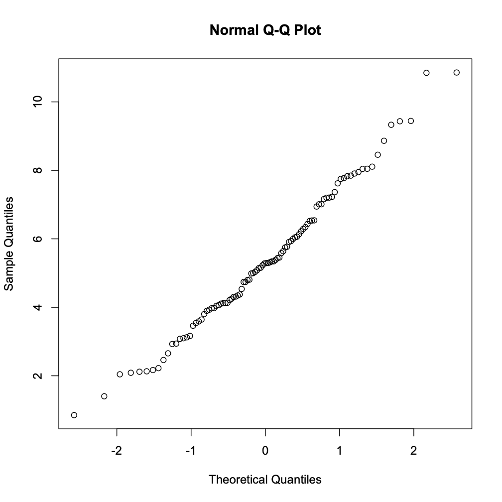
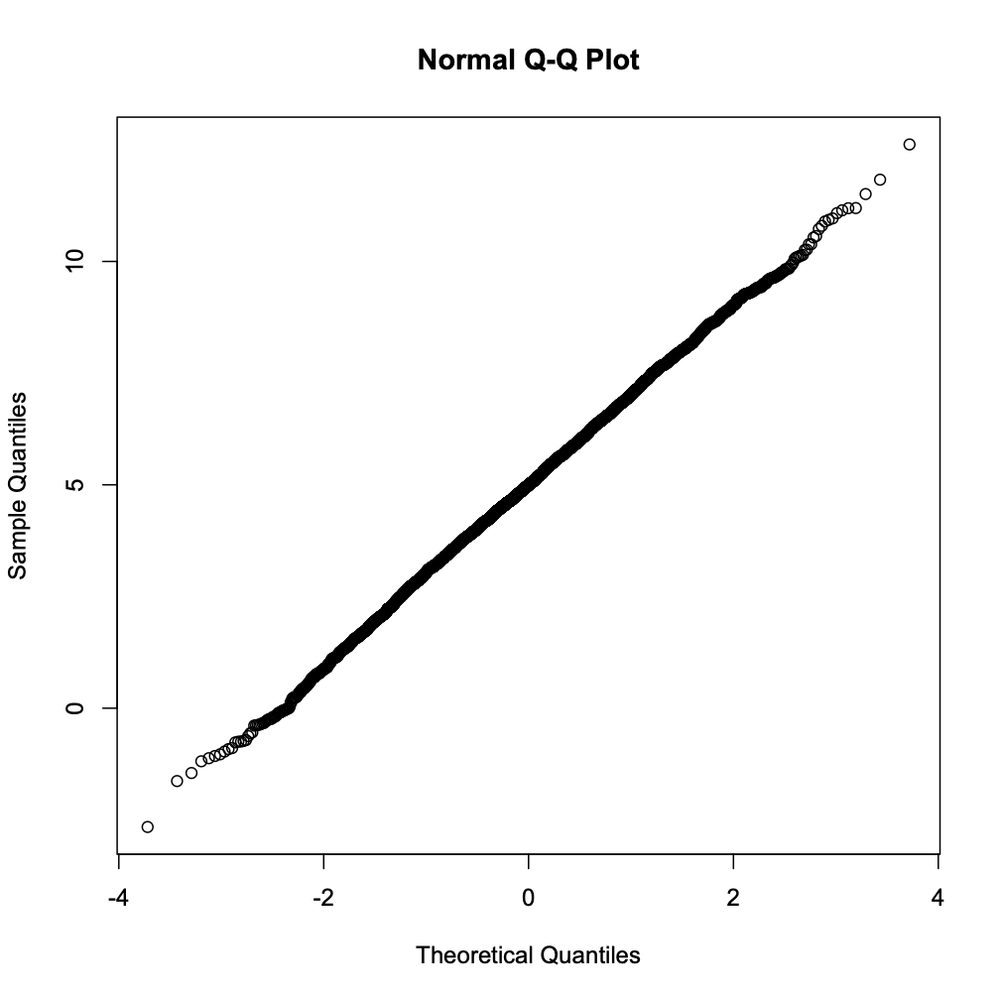

<br><br>

## Table of Contents

- [1. Staying Current with a Remote Repository](#staying-current-with-a-remote-repository)
	
	- [1.1 Copying or Cloning a Repository](#copying-or-cloning-a-repository)

	- [1.2 Keeping the Clone Current with Upstream](#keeping-the-clone-current-with-upstream)

- [2. Secure Communication with GitHub](#secure-communication-with-github)

	- [2.1 Configure Your System to Use SSH Keys](#configure-your-system-to-use-ssh-keys)

- [3. Collaborating on GitHub](#collaborating-on-github)

	- [3.1 ``team1`` Generate New Repository and Initial Content](#bears-generate-new-repository-and-initial-content)	

	- [3.2 ``team2`` Clone Repository and Edit it](#foxes-clone-repository-and-edit-it)

	- [3.3 ``team1`` Pull Updates and Add to the Repo](#bears-pull-updates-and-add-to-the-repo)

	- [3.4 ``team2`` Pull Updates](#foxes-pull-updates)

<br><br><br><br><br>
<br><br><br><br><br>
<br><br><br><br><br>
<br><br><br><br><br>
<br><br><br><br><br>
<br><br><br><br><br>

## 1. Staying Current with a Remote Repository

The official repository for this workshop is located at [https://github.com/wyoibc/rds22](https://github.com/wyoibc/rds22). Now that you have started following its contents, it makes sense to (1) have a copy of it on your computer, and (2) learn how to keep your copy current with what is upstream (i.e. on GitHub).  If you were to copy this repository right now, you will have the most current version of it. But once I make any changes to the upstream, your copy will become slightly stale.  In this section, we will learn how to make it current again.


### 1.1 Copying or Cloning a Repository

- Using the following command in your terminal session, clones the remote repository to the current location.  So be sure to navigate within your terminal to a place where you wish to make a copy.  

```bash
cd ~/Github

git clone https://github.com/wyoibc/rds22
```

<br>

### 1.2 Keeping the Clone Current with Upstream

- You don't have to know if the remote has changed; git will do that for you.  The following command will allow git to check your copy against the remote. If they are different, git will download updates and merge them with your copy. If they are identical, git will tell you so and it won't make any changes.


```bash
git pull
```

- You can use ``git pull`` as often as you wish. For RDS22, it is probably sufficient to pull it once a week. If you begin working on a project that is being updated more frequently, then you will benefit from pulling more often.


<br><br><br>

## 2. Secure Communication with GitHub

<br>

### 2.1 Configure Your System to Use SSH Keys

- First, make sure that ``ssh-agent`` is enabled on your system, and add your newly created ssh key to the agent. If you set up a passphrase earlier, you will need to enter it now.

```bash
ssh-agent -s

ssh-add /Users/wyoibc/.ssh/KEYNAME
```

- Make sure that the ssh-agent is using your key.

```bash
ssh-add -l

4096 SHA256:uMFoUIUC7osmgDQaNowsOnqEt3XmPPZe4RnR2+Q1KB0 name@host.edu (RSA)
```

- Second, open the configuration file for ssh

```bash
cd /Users/wyoibc/.ssh

vim config
```

- If this file doesn't exist, you will be creating a new one.  Add following lines to this file:


```bash
Host *
   AddKeysToAgent yes
   UseKeychain yes

Host wyoibc.github.com
        HostName github.com
        User git
        PreferredAuthentications publickey
        IdentityFile ~/.ssh/KEYNAME

```

- Save and close the file.


```bash
:wq
```


<br><br><br>


## 3. Collaborating on GitHub

- One of the advantages of putting your work on GitHub is that it makes collaborating with others very easy. For this section, you will find a partner to collaborate with.

	- Share your GitHub user name with your partner.
	
	- One of you will be part of ``team1`` team and the other of ``team2`` team.


### 3.1 ``team1`` Generate New Repository and Initial Content

- ``team1`` do the following:

	- Go to ``Github.com/YOUR_USER_ID`` and create a new repository called ``collab``

	- On your local computer, create a new folder ``collab`` inside the ``GitHub`` folder you created last week.

	- Inside this folder, open a new file in ``vim`` named ``README.md``

	- Type following content in this file:

		```bash
		---
		title: Collaborative Exercise in Github
		---


		## QQ Normalization

		```
	- Save and close the file (``:wq`` in vim).

	- Initialize new git repository inside ``collab``.

		```bash
		git init
		```

	- Configure the repository

		```bash
		git config user.name "YOUR_USER_NAME"
		git config user.email "YOUR_GITHUB_EMAIL_ADDRESS"
	
		git config --list

		git remote add origin git@github.com:YOUR_GITHUB_USERNAME/collab.git
		```

	- Add, commit and push files to your new repository

		```bash
		git add .
		git commit -m "Initial commit by team1"
		git push -u origin master
		```

	- If your SSH keys were correctly setup, the above should work without errors.

	- If the ``push`` was successful, go to your new GitHub.com repository, choose ``Settings`` >> ``Manage access`` and invite your partner as a collaborator.  You will need their user name.

<br><br>

### 3.2 ``team2`` Clone Repository and Edit it

- ``team2`` do the following:

	- You should have received an email from GitHub containing invitation from your ``team1`` partner to collaborate on the above repository.  Go ahead and accept it.

	- Inside your terminal session, go to the ``Github`` folder you created last week.

	- Clone the collaborative repository inside this folder

		```bash
		cd ~/Github
		git clone https://github.com/PARTNERS_GITHUB_ID/collab.git
		```

	- Open the ``README.md`` file in vim and set it aside for now. We are going to generate some new content for the repo.

	- Fire up a new ``R`` session, either inside your terminal or in R-Studio.

	- Generate normal distribution of ``length=100``, ``mean=5`` and ``STDEV=2``

		```r
		rnorm_100 <- rnorm(100, 5, 2)

		rnorm_100
		
		  [1]  3.2560410  3.9427234  6.5062322  2.6120940  8.4469923  3.7734777
		  [7]  6.6660813  6.7297231  7.6356562  1.2795508  8.7135774  4.7808433
		 [13]  3.2431209  4.5544523  8.0560542  5.1345238  4.5290398  3.0709138
		 [19]  4.9424754  4.9901400  4.8403945  4.7744570  4.9741091  8.5158795
		 [25]  6.7576175  3.1544909  5.1043582  7.2520960  4.7162988  5.2154195
		 [31]  5.6096246  7.2431140  5.3628224  7.0183478  3.0525487  5.7969017
		 [37] -0.2473231  5.4314736  2.9819134  5.6517750  5.1031163  5.2758484
		 [43]  3.9986785  3.6546439  1.0277276  8.2698047  2.9370657  3.8312321
		 [49]  5.1891104 -1.1718007  2.9092251  9.6024601  0.3102288  3.5233113
		 [55]  6.0785879  6.1443481  1.4895122  4.1123315  4.4962461  7.6709961
		 [61]  5.7954681  3.2487014  2.9246425  4.4178842  5.1267737  2.0772663
		 [67]  5.7256326  2.4347005  3.4792939  8.6661506  2.3007794  1.2865652
		 [73] 10.2528413  6.5529408  4.5308639  3.9096317  2.9602922  4.5660157
		 [79]  6.4765327  5.4774428  9.5770346  4.8439801  7.2007534  3.9652323
		 [85]  6.1064564  4.3177799  3.5924463  4.9280261  6.4032782  5.2160964
		 [91]  4.2959516  3.9489019  3.6501318  4.2419236  7.3105085  6.8059605
		 [97]  3.8606476  3.3618475  4.1134365  1.7566958
		```

	- Test how closely this vector fits normal distribution using the ``qqnorm`` function in R

		```r
		qqnorm(rnorm_100)
		```

<center>

</center>


- Save this file as ``rnorm_100.png`` in the current folder.

- Now let's go back to ``README.md`` and update its contents as follows:

```bash
---
title: Collaborative Exercise in Github
---

## QQ Normalization


- Normalizatio using rnorm 100 sampling

<center>

</center>
```

- Save and close the file. Then perform git operations as follows:

```bash
git add .
git commit -m "Edit by YOUR_GITHUB_USERNAME"
git push origin master
```

- Verify that the contents were uploaded to your partner's Github repository (on which you are a collaborator).


<br><br>

### 3.3 ``team1`` Pull Updates and Add to the Repo

- ``team1`` do the following:

	- Perform ``git pull`` inside collab to bring your local version up to date with changes present upstream

	- We will now update the ``README.md`` again by expanding the normal distribution from 100 to 1000 and 5000 respectively.

	- Fire up your ``R`` session:

		```r
		rnorm_1k <- rnorm(1000, 5, 2)
		rnorm_5k <- rnorm(5000, 5, 2)

		qqnorm(rnorm_1k)
		qqnorm(rnorm_5k)
		```

	- Update the ``README.md`` to include these two new figures

 
<center>

</center>


<br><br>

<center>

</center>


	- Finally, push the updates upstream with ``git add``, ``git commit`` and ``git push``


<br><br>

### 3.4 ``team2`` Pull Updates

- In the culmination of this exercises, ``team2`` will use ``git pull`` to update their local repository with the changes that were made by ``team2.  After this operation, open the README file to make sure you got all the changes. You won't see figures inside README, but they should be present in the folder.


