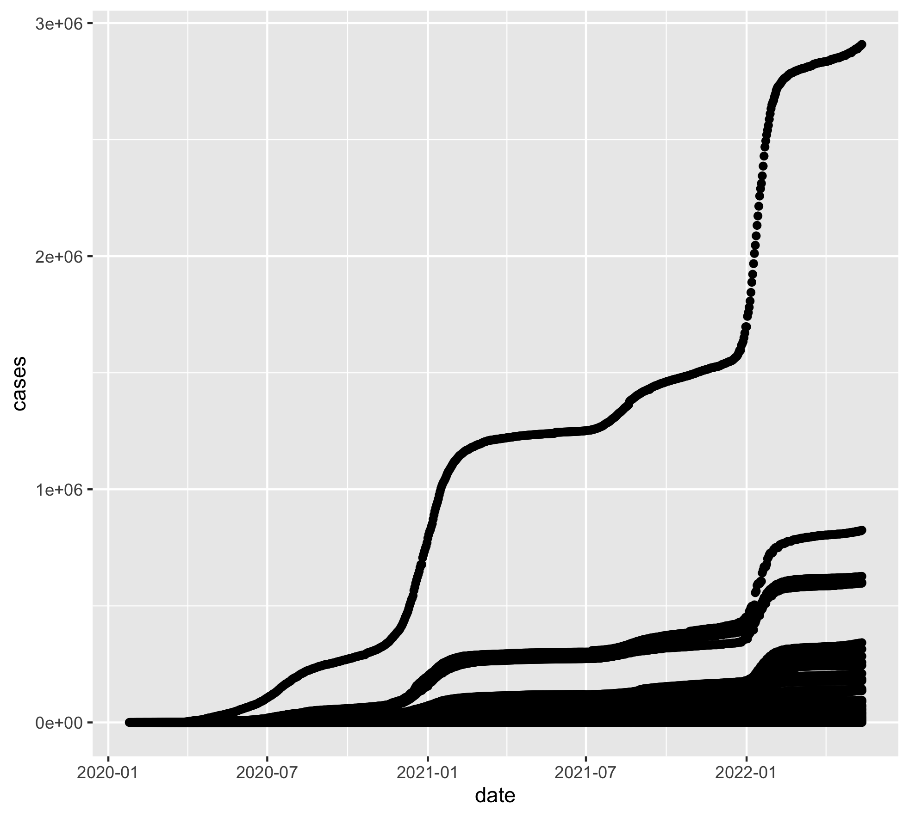
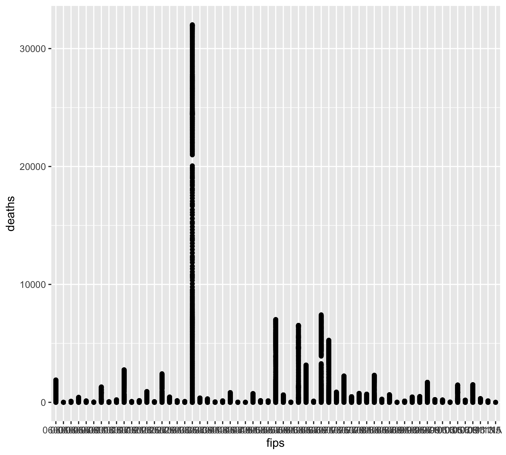

## Table of Contents

[1. How to Install Tidyverse?](#how-to-install-tidyverse)

[2. Reading Data with ``readr``](#reading-data-with-readr)

[3. Exploring Data with ``dplyr``](#exploring-data-with-dplyr)

[4. Exploratory Visualization with ``ggplot``](#exploratory-visualization-with-ggplot)


<br><br><br><br><br>
<br><br><br><br><br>
<br><br><br><br><br>
<br><br><br><br><br>
<br><br><br><br><br>
<br><br><br><br><br>


## 1. How to Install Tidyverse?

You can either follow the usual method of installing stable packages:

```r
install.packages("tidyverse")
```

Or you can get the developmental version from github:

```r
library(devtools)

devtools::install_github("hadley/tidyverse")
```

Tidyverse contains multiple packages and you can load them all at the same time:

```r
library(tidyverse)

── Attaching packages ────────────────────────────── tidyverse 1.3.1.9000 ──
✔ ggplot2 3.3.6     ✔ purrr   0.3.4
✔ tibble  3.1.7     ✔ dplyr   1.0.9
✔ tidyr   1.2.0     ✔ stringr 1.4.0
✔ readr   2.1.2     ✔ forcats 0.5.1
── Conflicts ─────────────────────────────────────── tidyverse_conflicts() ──
✖ dplyr::filter() masks stats::filter()
✖ dplyr::lag()    masks stats::lag()
```

You will notice a couple of conflicts above. R is telling us that the ``filter()`` and ``lag()`` functions from the ``dplyr`` packages are named identically to functions we already have on our installation of the ``stats`` package. It is also telling us that those ``stats`` library functions are now fully masked by ``dplyr``.

This of course does not mean that those functions are not available to you any longer. In fact, you can still call them using the following syntax:

``library::function()``

For example:

```r
stats::lag()
stats::filter()
```

Now, let's delve into studying some of the packages from Tidyverse.

<br><br>

## 2. Reading Data with ``readr``

As the name suggests, this package contains functions for reading data into R. You might ask, what's so fancy about that? Doesn't ``base-r`` already contain functions to do those tasks? And you'd be right. But functions in ``readr`` provide significant improvement over their ``base-r`` counterparts. 

## 2.1 Functions in ``readr``

There are six functions available in this package to read different file types:

- ``read_csv()``: comma-separated values (CSV) files
- ``read_tsv()``: tab-separated values (TSV) files
- ``read_delim()``: delimited files (CSV and TSV are important special cases)
- ``read_fwf()``: fixed-width files
- ``read_table()``: whitespace-separated files
- ``read_log()``: web log files


```r
chickens <- read_csv(readr_example("chickens.csv"))

Rows: 5 Columns: 4                                                                                                 
── Column specification ──────────────────
Delimiter: ","
chr (3): chicken, sex, motto
dbl (1): eggs_laid
```

```r
spec(chickens)

spec(chickens)
cols(
  chicken = col_character(),
  sex = col_character(),
  eggs_laid = col_double(),
  motto = col_character()
)

```

- The ``spec`` function displays the type of data present in each column. You can also get the same type of information by simply printing the data frame to screen:

```r
chickens

# A tibble: 5 × 4
  chicken                 sex     eggs_laid motto                               
  <chr>                   <chr>       <dbl> <chr>                               
1 Foghorn Leghorn         rooster         0 That's a joke, ah say, that's a jok…
2 Chicken Little          hen             3 The sky is falling!                 
3 Ginger                  hen            12 Listen. We'll either die free chick…
4 Camilla the Chicken     hen             7 Bawk, buck, ba-gawk.                
5 Ernie The Giant Chicken rooster         0 Put Captain Solo in the cargo hold. 
```

- Under each column header, you will see an acronym for the type of data in that column: ``chr`` for character and ``dbl`` for numerical data.

- If this is your first time working with tidyverse, you will notice differences in how these packages display data frames in contrast with base-r. If you call the name of the data frame, base-r will spit out the first 10000 (or less if the file is smaller) lines of the file to the screen at once. Tidyverse does things differently. By default, it will show the first six rows and first few columns of data as shown above. This particular style of display is called a ``tibble``, which is a package in itself.

- Let's try another example. We will read a file from New York Times' COVID-19 github repository. We don't need to download the file, we will read it directly from a url. This file is ~100MB in size and contains COVID-19 cases and deaths data for all US counties.

```r
ct <- read_csv("https://raw.githubusercontent.com/nytimes/covid-19-data/master/us-counties.csv")
```

- If you typed the URL correctly, you should see progress like this:

```r
Rows: 2502832 Columns: 6                                                      
── Column specification ─────────────────────────────────────────────
Delimiter: ","
chr  (3): county, state, fips
dbl  (2): cases, deaths
date (1): date

ℹ Use `spec()` to retrieve the full column specification for this data.
ℹ Specify the column types or set `show_col_types = FALSE` to quiet this message.
> spec(ct)
cols(
  date = col_date(format = ""),
  county = col_character(),
  state = col_character(),
  fips = col_character(),
  cases = col_double(),
  deaths = col_double()
)
```

- Hopefully your internet speed is good because ``readr`` will import that file very fast. Let's check what the tibble view looks like on this file:


```r
ct

# A tibble: 2,502,832 × 6
   date       county      state      fips  cases deaths
   <date>     <chr>       <chr>      <chr> <dbl>  <dbl>
 1 2020-01-21 Snohomish   Washington 53061     1      0
 2 2020-01-22 Snohomish   Washington 53061     1      0
 3 2020-01-23 Snohomish   Washington 53061     1      0
 4 2020-01-24 Cook        Illinois   17031     1      0
 5 2020-01-24 Snohomish   Washington 53061     1      0
 6 2020-01-25 Orange      California 06059     1      0
 7 2020-01-25 Cook        Illinois   17031     1      0
 8 2020-01-25 Snohomish   Washington 53061     1      0
 9 2020-01-26 Maricopa    Arizona    04013     1      0
10 2020-01-26 Los Angeles California 06037     1      0
# … with 2,502,822 more rows

```


<br><br>

## 3. Exploring Data with ``dplyr``

<br>

### 3.1 Using Pipes

- If you are familiar with the pipe function in Unix (``|``), the R pipe works similarly (albeit it uses a different symbol). The goal is to use output from one command and pass it onto another function. Just like the Unix pipe, the R pipe can also be nested as many times as you want.  We will see some examples below.

- What if you wanted to print 15 rows of data from the above tibble to the screen?

```r
ct %>% print(n=15, width=Inf)

# A tibble: 2,502,832 × 6
   date       county      state      fips  cases deaths
   <date>     <chr>       <chr>      <chr> <dbl>  <dbl>
 1 2020-01-21 Snohomish   Washington 53061     1      0
 2 2020-01-22 Snohomish   Washington 53061     1      0
 3 2020-01-23 Snohomish   Washington 53061     1      0
 4 2020-01-24 Cook        Illinois   17031     1      0
 5 2020-01-24 Snohomish   Washington 53061     1      0
 6 2020-01-25 Orange      California 06059     1      0
 7 2020-01-25 Cook        Illinois   17031     1      0
 8 2020-01-25 Snohomish   Washington 53061     1      0
 9 2020-01-26 Maricopa    Arizona    04013     1      0
10 2020-01-26 Los Angeles California 06037     1      0
11 2020-01-26 Orange      California 06059     1      0
12 2020-01-26 Cook        Illinois   17031     1      0
13 2020-01-26 Snohomish   Washington 53061     1      0
14 2020-01-27 Maricopa    Arizona    04013     1      0
15 2020-01-27 Los Angeles California 06037     1      0
# … with 2,502,817 more rows
 
```

- In the example above, we used ``Inf`` option for the width of the tibble.  Because this tibble is small, it fits comfortable on our screen. However, if your tibble was much wider than this, you could restrict the width to match that of your display. For example, try the following three commands and try to notice the differences between the three outputs:


```r
ct %>% print(n=15, width=50)

ct %>% print(n=15, width=25)

ct %>% print(n=15, width=20)
```

- What was different about the outputs?


- If you wanted to find out how many different states have been represented in this data set:

```r
ct %>% count(state)

# A tibble: 56 × 2
   state                    n
   <chr>                <int>
 1 Alabama              52312
 2 Alaska               20568
 3 American Samoa         239
 4 Arizona              11934
 5 Arkansas             59032
 6 California           45693
 7 Colorado             49527
 8 Connecticut           7091
 9 Delaware              3131
10 District of Columbia   798
# … with 46 more rows

```

This shows that there are a total of 56 states/territories covered here. ``count`` is a function from the library ``dplyr``, part of core Tidyverse.  The pipe (``%>%``) is not part of tidyverse; it comes from a package named ``magritter`` which is a dependency for tidyverse.

Note how a tibble always displays the first few rows by default. In this particular case, if you wanted to print all 56 rows, what would you do?

```r
ct %>% count(state) %>% print(n=56)

# A tibble: 56 × 2
   state                         n
   <chr>                     <int>
 1 Alabama                   52312
 2 Alaska                    20568
 3 American Samoa              239
 4 Arizona                   11934
 5 Arkansas                  59032
 6 California                45693
 7 Colorado                  49527
 8 Connecticut                7091
 9 Delaware                   3131
10 District of Columbia        798
11 Florida                   53362
12 Georgia                  124889
13 Guam                        790
14 Hawaii                     3982
15 Idaho                     33184
16 Illinois                  79502
17 Indiana                   71921
18 Iowa                      77070
19 Kansas                    79294
20 Kentucky                  92572
21 Louisiana                 50902
22 Maine                     13097
23 Maryland                  19645
24 Massachusetts             11914
25 Michigan                  65202
26 Minnesota                 67883
27 Mississippi               64147
28 Missouri                  89600
29 Montana                   40656
30 Nebraska                  69255
31 Nevada                    12867
32 New Hampshire              8612
33 New Jersey                17417
34 New Mexico                25445
35 New York                  45692
36 North Carolina            77809
37 North Dakota              40499
38 Northern Mariana Islands   1832
39 Ohio                      69101
40 Oklahoma                  59923
41 Oregon                    27784
42 Pennsylvania              52441
43 Puerto Rico               58397
44 Rhode Island               4704
45 South Carolina            36091
46 South Dakota              49552
47 Tennessee                 74719
48 Texas                    193519
49 Utah                      22919
50 Vermont                   11758
51 Virgin Islands             2492
52 Virginia                 103128
53 Washington                30893
54 West Virginia             42238
55 Wisconsin                 55993
56 Wyoming                   17815
```

<Br><br>


### 3.2 Accessing Specific Data From Tibbles

- Let's say we wish to access data from Nevada.


```r
ct %>% filter(state=="Nevada")

# A tibble: 12,867 × 6
   date       county state  fips  cases deaths
   <date>     <chr>  <chr>  <chr> <dbl>  <dbl>
 1 2020-03-05 Clark  Nevada 32003     1      0
 2 2020-03-05 Washoe Nevada 32031     1      0
 3 2020-03-06 Clark  Nevada 32003     1      0
 4 2020-03-06 Washoe Nevada 32031     1      0
 5 2020-03-07 Clark  Nevada 32003     1      0
 6 2020-03-07 Washoe Nevada 32031     1      0
 7 2020-03-08 Clark  Nevada 32003     2      0
 8 2020-03-08 Washoe Nevada 32031     2      0
 9 2020-03-09 Clark  Nevada 32003     2      0
10 2020-03-09 Washoe Nevada 32031     2      0
# … with 12,857 more rows

```

- What if you want to print 20 rows of data from Nevada?


```r
ct %>% filter(state=="Nevada") %>% print(n=20)
```

Try the same command on any other state or territory:


```r
ct %>% filter(state=="Puerto Rico") %>% print(n=20)
# A tibble: 58,397 × 6
   date       county  state       fips  cases deaths
   <date>     <chr>   <chr>       <chr> <dbl>  <dbl>
 1 2020-03-13 Unknown Puerto Rico NA        3      0
 2 2020-03-14 Unknown Puerto Rico NA        4      0
 3 2020-03-15 Unknown Puerto Rico NA        5      0
 4 2020-03-16 Unknown Puerto Rico NA        5      0
 5 2020-03-17 Unknown Puerto Rico NA        5      0
 6 2020-03-18 Unknown Puerto Rico NA        5      0
 7 2020-03-19 Unknown Puerto Rico NA        6      0
 8 2020-03-20 Unknown Puerto Rico NA       14      0
 9 2020-03-21 Unknown Puerto Rico NA       21      1
10 2020-03-22 Unknown Puerto Rico NA       23      1
11 2020-03-23 Unknown Puerto Rico NA       31      2
12 2020-03-24 Unknown Puerto Rico NA       39      2
13 2020-03-25 Unknown Puerto Rico NA       51      2
14 2020-03-26 Unknown Puerto Rico NA       64      2
15 2020-03-27 Unknown Puerto Rico NA       79      3
16 2020-03-28 Unknown Puerto Rico NA      100      3
17 2020-03-29 Unknown Puerto Rico NA      127      5
18 2020-03-30 Unknown Puerto Rico NA      174      6
19 2020-03-31 Unknown Puerto Rico NA      239      8
20 2020-04-01 Unknown Puerto Rico NA      286     11
# … with 58,377 more rows

```

- What if you only want to print the following columns from Hawaii: date, state, county and cases?

```r
ct %>% filter(state=="Hawaii") %>% select(1:2, 5:6)

# A tibble: 3,982 × 4
   date       county   cases deaths
   <date>     <chr>    <dbl>  <dbl>
 1 2020-03-06 Honolulu     1      0
 2 2020-03-07 Honolulu     1      0
 3 2020-03-08 Honolulu     2      0
 4 2020-03-09 Honolulu     2      0
 5 2020-03-10 Honolulu     2      0
 6 2020-03-11 Honolulu     2      0
 7 2020-03-12 Honolulu     2      0
 8 2020-03-13 Honolulu     2      0
 9 2020-03-14 Honolulu     2      0
10 2020-03-14 Kauai        2      0
# … with 3,972 more rows
```
 
- Notice that we used column numbers above instead of their names. But of course, you could achieve the same result using names:

```r
ct %>% filter(state=="Hawaii") %>% select("date", "county", "cases", "deaths")
```


- Repeat the last command with California:

```r
ct %>% filter(state=="California") %>% select("date", "county", "cases", "deaths") 

# A tibble: 45,693 × 4
   date       county      cases deaths
   <date>     <chr>       <dbl>  <dbl>
 1 2020-01-25 Orange          1      0
 2 2020-01-26 Los Angeles     1      0
 3 2020-01-26 Orange          1      0
 4 2020-01-27 Los Angeles     1      0
 5 2020-01-27 Orange          1      0
 6 2020-01-28 Los Angeles     1      0
 7 2020-01-28 Orange          1      0
 8 2020-01-29 Los Angeles     1      0
 9 2020-01-29 Orange          1      0
10 2020-01-30 Los Angeles     1      0
# … with 45,683 more rows
```
- California data consists of 45693 rows altogether.  

- You have just used two new functions from the ``dplyr`` package. If you are curious about details of these functions, you can always look at the package help menu:


```r
?filter

Help on topic ‘filter’ was found in the following packages:

  Package               Library
  dplyr                 /Library/Frameworks/R.framework/Versions/4.0/Resources/library
  stats                 /Library/Frameworks/R.framework/Versions/4.0/Resources/library
```

- As you see above, sometimes same function names are used in multiple packages.  To choose the correct one, be more explicit as follows:

```r
?dplyr::filter

?dplyr::select
```

<br><br>

## 4 Exploratory Visualization with ``ggplot``

- Pipes make it very easy to subset data and plot it on the fly without creating any additional objects. This functionality is rather useful when exploring the data.

```r
ct %>% filter(state=="California") %>% select("date", "state", "cases", "deaths")  %>% ggplot() + geom_point(aes(x=date, y=cases))
```

<center>
 </img>
</center>

- Next, let's plot the number of cases per county in California


```r
ct %>% filter(state == "California") %>% ggplot() + geom_point(aes(x=fips, y=cases))
```

<center>

</center>


- It seems that one of the counties has disproportionately higher number of cases. How would we find out what county that is?


```r
ct %>% filter(state == "California") %>% filter(cases > 2e+06)

# A tibble: 124 × 6
   date       county      state      fips    cases deaths
   <date>     <chr>       <chr>      <chr>   <dbl>  <dbl>
 1 2022-01-10 Los Angeles California 06037 2011668  27798
 2 2022-01-11 Los Angeles California 06037 2046912  27812
 3 2022-01-12 Los Angeles California 06037 2087285  27850
 4 2022-01-13 Los Angeles California 06037 2132227  27985
 5 2022-01-14 Los Angeles California 06037 2172712  27985
 6 2022-01-15 Los Angeles California 06037 2214368  28008
 7 2022-01-16 Los Angeles California 06037 2258206  28059
 8 2022-01-17 Los Angeles California 06037 2289749  28086
 9 2022-01-18 Los Angeles California 06037 2312272  28122
10 2022-01-19 Los Angeles California 06037 2344525  28181
# … with 114 more rows
```

- What do the numbers look like for deaths?


```r
ct %>% filter(state == "California") %>% ggplot() + geom_point(aes(x=fips, y=deaths))
```


<center>

</center>


- A quick eyeballing points likely to the same county for largest number of deaths. Just to verify:

```r
ct %>% filter(state == "California") %>% filter(deaths > 30000)

# A tibble: 87 × 6
   date       county      state      fips    cases deaths
   <date>     <chr>       <chr>      <chr>   <dbl>  <dbl>
 1 2022-02-16 Los Angeles California 06037 2770076  30081
 2 2022-02-17 Los Angeles California 06037 2773273  30146
 3 2022-02-18 Los Angeles California 06037 2777869  30216
 4 2022-02-19 Los Angeles California 06037 2781027  30300
 5 2022-02-20 Los Angeles California 06037 2783657  30356
 6 2022-02-21 Los Angeles California 06037 2784980  30376
 7 2022-02-22 Los Angeles California 06037 2786153  30411
 8 2022-02-23 Los Angeles California 06037 2788063  30447
 9 2022-02-24 Los Angeles California 06037 2789996  30519
10 2022-02-25 Los Angeles California 06037 2792334  30587
# … with 77 more rows

```

- Now try to make the last two plots for your home state and find out which county had the highest number of cases and deaths.  Report back county name and associated numbers. If California is your home stater, choose some other state.

<br><br>


### 4.1 Exercises

1. Access the ``prisons/`` directory within the NYT covid-19-data repository at github.com and import the ``facilities.csv`` data into R (store it as an object ``fac``).

2. How many rows and columns of data is present in the facilities data set?

3. Use the pipe function to display only these columns: facility name, state, inmate cases, inmate deaths 

4. Count the total number of prison facilities.

5. Count the number of facilities per state.

6. Using the ``fac_sub`` tibble make a scatterplot of inmate cases vs inmate deaths in ggplot.

7. Which state had the highest number of inmate cases or deaths?


<br><br>

## 4.2 Visualizing Data on Maps

- First install the following two packages:

	- ``maps``
	
	- ``mapdata``

- Load the packages

- Create base USA map object

```r
usa <- map_data('usa')

states <- map_data('state')

usa_base <- ggplot(data=states) + geom_polygon(aes(x=long, y=lat, fill=I('white'), group=group), color='gray') + coord_fixed(1.3) + guides(fill=FALSE)
```

- Print basic USA map to the screen

```r
usa_base
```

<center>

</center>

- Add locations of the prison facilities to the map

```r
usa_base + geom_point(data=fac, aes(x=facility_lng, y=facility_lat), color="darkgreen", cex=0.5, alpha=3/10) + coord_fixed(xlim=c(-130, -60), ylim=c(25,50), ratio=1.3)
```


<center>

</center>


 
